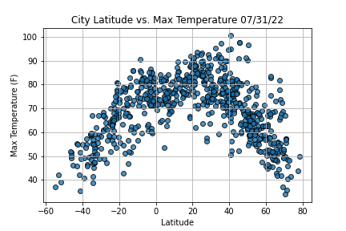
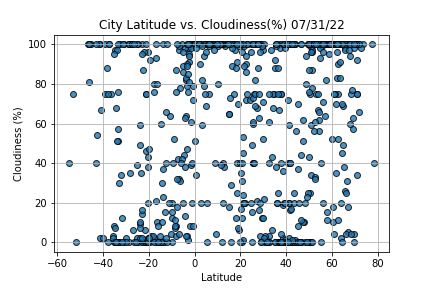
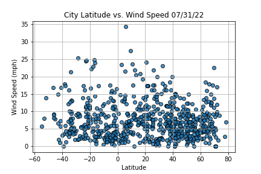
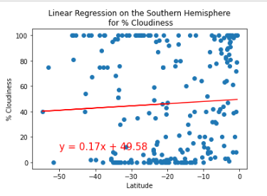

# World_Weather_Analysis

## An exploratory analysis using APIs to retrieve and visualize weather data around the world.

### Project Overview

This exploratory analyisis collects, examines and visualizes weather data around the world, specifically providing travelers data in destinations that match their specified temperature perameters. A sample travel itinerary is depicted below that catalogs the hotel listings and travel routes for four cities in coastal Brazil, 
further illustrating the capabilities of this analysis to potential travelers. A statistical analysis is conducted using linear regression to study the relationship between weather and region by hemisphere as well as by city latitudes and longitudes.   

#### Resources: 
* Software: Jupyter Notebook, Anaconda, Python 3.7.6 (Dependencies: Pandas, Matplotlib, NumPy, SciPy, Python Requests, JSON Traversals)
* APIs: Google Maps, Google Directions, Openweathermap.org

### Weather Database

A randomized set of 2,000 latitudes and longitudes was generated using an API call that gathered weather data from OpenWeatherMap.org for the nearest correspondning cities. The latitudes and longitudes, minumum and maximum temperatures, humidity percentages, cloudiness percentages, wind speeds and current weather descriptions were retrieved during this API call. This data was compiled into a CSV file and exported into our analysis folder, suppliying the data used throughout this analysis.  

Below are heat map visualizations generated using the Google Maps API that depict the aforementioned catergories retrieved during the OpenWeatherMap API call.

#### Heatmap depicting cloudiness:

#### Heatmap depicting humidity:

#### Heatmap depicting temperature:

#### Heatmap depicting wind speed:

### Vacation Search

Travelers' preferences on minimum and maximum temperatures were programmed into this exploration using the Google Maps API. Below are various destinations across the globe that fit into the specified perameters. 

Below is a screenshot of the code used to enter the potential traveler's minimum and maximum temperature preferences:

Using the desired temperature perameters, an interactive, layered map is created with pop-up markers. The pop-up markers display hotel names, city and country names, current weather and max temperatures when a selection is made. 

### Vacation Itinerary

The Google Directions API is utlized during the analysis below to display the routes between four cities in Brazil that match the travelers' temperature preferences. 
This is also a layer map that allows the travelers to view pop-up markers listing the hotel names, city names, country names and current weather descriptions. 

Below is an itinerary overview listing the travel routes, as well as images of the pop-up marker descriptions for the four chosen cities in Brazil. 

#### Overview of travel itinerary:

#### Destination 1: Touros, Brazil

#### Destination 2: Cabedelo, Brazil

#### Destination 3: Olinda, Brazil

#### Destination 4: Maragogi, Brazil

### Statistical Analysis

A statistical analysis was conducted to study the relationship between latitude versus maximum temperature, humidity, cloudiness, and wind speed using global city data. In the scatterplot visualizations, a definite correlation in latitude and maximum temperature is observed. Metrics such as wind speed, humidity and cloudiness are more unpredictable, making their relationships versus city latitude more difficult to see. When these charts are all observed together, the viewer is able to observe which latitudes are lowest and highest in all categories at a glance. 

Below are scatterplot visualizations depicting this analysis using data obtained using the OpenWeatherMap API. 

#### Maximum Temperature

#### Humidity Percentages

#### Cloudiness Percentages

#### Wind Speeds

Linear regression was then performed for the latitudes of the Northern and Southern Hemispheres using the same four weather metrics measured above: maximum temperature, humidity, cloudiness and wind speed. The direct correlation of hemispherical latitude versus maximum temperature is observed. Similar to the scatterplot analysis above, wind speed, humidity and cloudiness present unpredicable relationships with the hemispherical latitudes they occur within. 

### Northern Hemisphere 

#### Maximum Temperature

#### Humidity Percentages

#### Cloudiness Percentages

#### Wind Speeds

### Southern Hemisphere

#### Maximum Temperature

#### Humidity Percentages

#### Cloudiness Percentages

#### Wind Speeds

